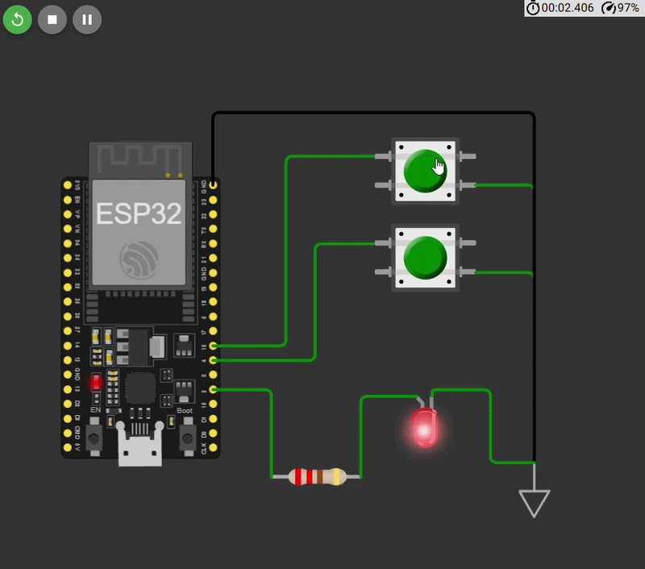

# Práctica 01: Control de LED con Dos Botones

## 📋 Objetivo
Implementar un circuito que permita encender y apagar un LED utilizando dos botones pulsadores conectados a una ESP32, configurando correctamente los pines GPIO y utilizando resistencias de pull-up internas.

## 🔧 Materiales Utilizados
- 1x ESP32 DevKit V1
- 1x LED (cualquier color)
- 2x Botones pulsadores de 4 pines
- 1x Resistencia de 220Ω (para el LED)
- Cables Dupont
- 1x Protoboard

## 📐 Diagrama de Conexiones

### Conexiones ESP32:
- **GPIO 2** → Resistencia 220Ω → LED → GND
- **GPIO 4** → Botón ON → GND
- **GPIO 16** → Botón OFF → GND
- **3.3V/GND** → Alimentación del circuito

### Esquema:
```text
[ ESP32 Board ]
       |
       +--- 3V3 / VIN ----> [ Módulo Relé: VCC ]
       |
       +--- GND -----------> [ Módulo Relé: GND ]
       |
       +--- GPIO 26 -------> [ Módulo Relé: IN  ] (Control)
       |
       +--- GPIO 14 -------> [ Botón 1: Pin 1 ] (Encendido)
       |                     [ Botón 1: Pin 2 ] ---> GND
       |
       +--- GPIO 27 -------> [ Botón 2: Pin 1 ] (Apagado)
                             [ Botón 2: Pin 2 ] ---> GND

```                            

## 💡 Funcionamiento
- **Botón ON (GPIO 4):** Al presionarlo, el LED se enciende
- **Botón OFF (GPIO 16):** Al presionarlo, el LED se apaga
- Se utilizan **resistencias de pull-up internas** (`INPUT_PULLUP`), por lo que los botones conectan a GND cuando se presionan (activo en LOW)

## 📂 Archivos
- `codigo/control_led.ino` - Código principal en Arduino IDE

##  Ver simulación
  

