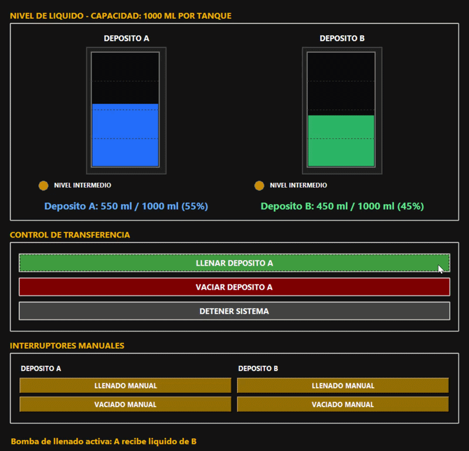

# Práctica 03: Control Automatizado de Llenado y Vaciado de Líquidos

## 📋 Objetivo
Implementar un sistema de control de nivel de líquidos bidireccional utilizando un ESP32, sensor ultrasónico y bombas externas. El sistema garantiza la seguridad operativa mediante paradas automáticas por nivel (80% llenado ), exclusión mutua de actuadores y timeout de protección, todo monitoreado desde una interfaz gráfica de escritorio.

> 💡 **Nota del Equipo:**  
> Ante la indisponibilidad de una pantalla LCD con módulo I2C, el equipo diseñó e implementó una **Interfaz Gráfica de Usuario (GUI) nativa en Python (Tkinter)**. Esta solución no solo suple la falta de hardware, sino que ofrece capacidades superiores: simulación visual en tiempo real, cambio dinámico de colores por estado y control de precisión por mililitros, funcionando como un verdadero panel de control SCADA a escala.

---

## ⚙️ Lógica del Sistema
El sistema gestiona la transferencia de líquido entre dos depósitos (A y B) con una capacidad total conservada de 1000 ml. 
- **Exclusión Mutua:** El firmware garantiza que ambas bombas nunca se activen simultáneamente, evitando cortocircuitos o desbordamientos.
- **Conservación de Masa:** El volumen transferido se calcula en tiempo real; lo que gana un depósito, lo pierde el otro.
- **Protección de Hardware:** Incluye un *timeout* de seguridad (apagado forzoso tras 60s de operación continua) y detección de fallos del sensor ultrasónico.

---

## 🛠️ Hardware y Software Utilizado

| Categoría | Componentes / Herramientas |
| :--- | :--- |
| **Microcontrolador** | ESP32 DevKit V1 |
| **Sensores** | HC-SR04 (Ultrasonido para medición de nivel no invasiva) |
| **Actuadores** | 2x Bombas de agua DC (R385), Módulo de Relé de 2 canales |
| **Interfaz Humana** | Aplicación de escritorio en Python (Tkinter + PySerial) |
| **Entorno de Desarrollo** | Arduino IDE (Firmware), VS Code (Python) |

### Aplicación de Escritorio (Python + Tkinter)
- **Simulación Visual:** Canvas que representa el nivel del tanque con cambio de color dinámico (🔵 Azul = Normal, 🔴 Rojo = Crítico ≤20%, 🟠 Naranja = Lleno ≥80%).
- **Control Dual:** 
  - *Modo Automático:* Ciclos completos hasta los límites seguros.
  - *Modo Precisión:* Sliders para transferir cantidades exactas en mililitros.
- **Robustez Serial:** Implementa pausa de 2.5s post-conexión y limpieza de buffer (`reset_input_buffer`) para manejar el reinicio automático del ESP32 y evitar errores `PermissionError`.

---

## 📐 Diagrama de Conexiones

| Componente | Pin ESP32 | Nota |
| :--- | :---: | :--- |
| **HC-SR04 (Trig)** | GPIO 5 | Salida de pulso |
| **HC-SR04 (Echo)** | GPIO 18 | Entrada de lectura |
| **Relé Bomba Llenado** | GPIO 22 | Lógica gestionada por firmware |
| **Relé Bomba Vaciado** | GPIO 23 | Lógica gestionada por firmware |
| **GND** | GND | Tierra común con fuente de bombas |

---

## 🔄 Protocolo de Comunicación Serial

La interfaz Python y el ESP32 se comunican mediante un protocolo de texto plano robusto:

| Dirección | Comando / Formato | Descripción |
| :--- | :--- | :--- |
| **PC → ESP32** | `EMPEZAR_LLENAR` | Activa bomba de llenado y temporizador. |
| **PC → ESP32** | `EMPEZAR_VACIAR` | Activa bomba de vaciado y temporizador. |
| **PC → ESP32** | `DETENER_TODO` | Desactiva ambas bombas inmediatamente. |
| **ESP32 → PC** | `DATA:distancia,porcentaje` | Envío continuo de telemetría (ej: `DATA:5.2,45.0`). |
| **ESP32 → PC** | `AUTO_STOP: MOTIVO` | Notifica a la GUI que el hardware detuvo el proceso por seguridad. |

---

## 🚀 Instrucciones de Ejecución

1. **Preparación del Entorno:**
   - Asegúrate de tener Python 3.10 instalado.
   - Instala la librería serial: `pip install pyserial`
2. **Configuración del Hardware:**
   - Conecta el ESP32 por USB.
   - **¡IMPORTANTE!** Cierra el "Monitor Serie" del Arduino IDE o cualquier otro programa que esté usando el puerto COM, de lo contrario Python no podrá conectarse.
3. **Ejecución:**
   - Abre una terminal en la carpeta del proyecto.
   - Ejecuta: `python Practica_Bomba.py` (o el nombre exacto de tu archivo `.py`).
   - La interfaz se conectará automáticamente, esperará el reinicio del ESP32 y comenzará a mostrar los datos en tiempo real.

---

## 📂 Archivos de la Práctica
- `codigo/control_bomba.ino` - Firmware del ESP32 con lógica de seguridad.
- `codigo/Practica_Bomba.py` - Interfaz gráfica de control en Python (Tkinter).
- `materiales.md` - Lista detallada de componentes y cantidades.
- `imagenes/` - Capturas de pantalla de la interfaz gráfica y montaje físico.

---
##  Ver simulación

)

> 🌐 **Prueba tu mismo los entornos:** Todos los proyectos cuentan con un [Gemelo Digital para interactuar ](https://coe-embedded-lab.streamlit.app).

---  

## 🎥 Demostraciones y Pruebas Realizadas

A continuación se presentan las pruebas de validación del sistema, demostrando su comportamiento bajo diferentes configuraciones de límites operativos.

### 1. Modo Automático (Llenado y Drenado con Límites)
En este modo, el sistema respeta los límites mínimo y máximo configurados en la interfaz. Al alcanzar el límite, el ESP32 envía una señal de `AUTO_STOP` y la interfaz detiene la bomba, invirtiendo el ciclo si está en modo bucle, o deteniéndose por seguridad.

**Casos de prueba validados:**
- Rango **10% - 50%** (Drenado profundo y llenado parcial)
- Rango **20% - 60%** (Operación estándar de mantenimiento)
- Rango **20% - 80%** (Rango operativo recomendado por defecto)
- Rango **40% - 50%** (Zona estrecha de alta precisión)
- Rango **50% - 60%** (Prueba de respuesta rápida en rango medio)

> *Nota: Observa cómo la barra de progreso y el indicador LED cambian de color (Verde = lleno, Naranja = intermedio, Rojo = Vacio) y cómo el sistema se detiene automáticamente al alcanzar el porcentaje configurado.*

---

### 2. Modo Manual (Control Directo)
Este modo permite al operador tomar el control total de las bombas, ignorando temporalmente los límites automáticos para tareas de mantenimiento, purga o calibración. El sistema sigue mostrando advertencias visuales si se exceden los rangos seguros, pero permite la acción bajo responsabilidad del usuario.

**Pruebas realizadas:**
- Activación individual de la bomba de llenado (Depósito A recibe líquido).
- Activación individual de la bomba de vaciado (Depósito A envía líquido).
- Parada de emergencia inmediata desde la interfaz.

> *Nota: Se observa la respuesta inmediata de la interfaz al presionar los botones manuales y la actualización en tiempo real de la telemetría enviada por el ESP32.*

---

## ⚠️ Consideraciones de Seguridad
- Calibrar la constante de caudal (`ML_POR_SEGUNDO`) en el código Python midiendo el volumen real bombeado.
