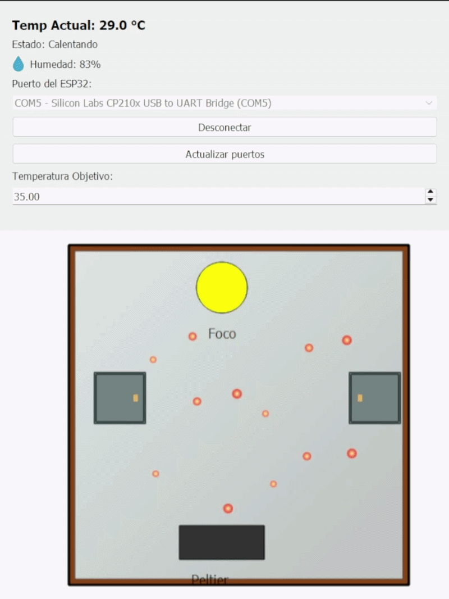

# 🌡️ Proyecto 04: Caja Térmica Inteligente con Sistema de Purga

## 📋 Objetivo
Diseñar e implementar una cámara térmica controlada por un microcontrolador ESP32, capaz de mantener una temperatura dentro de un rango mediante un sistema de calefacción (foco) y refrigeración (módulo Peltier). El sistema incluye una purga condicional al cambiar el rango y detectar que la temperatura está a más de 2 °C de sus límites.

---

## ⚙️ Lógica de Control y Funcionamiento

El firmware implementa un control robusto basado en tres pilares fundamentales:

1. **Control por rango:**
   Activa el foco bajo el límite mínimo, la celda Peltier sobre el máximo y mantiene ambas salidas apagadas dentro del rango.
2. **Purga condicional:**
   Solo al cambiar el rango y si la temperatura está fuera del nuevo rango por más de 2 °C, el sistema entra en **Fase de Purga**:
   - Abre las tapas superiores mediante servomotores (SG90).
   - Activa los ventiladores de extracción para renovar el aire estancado.
   - Cierra las tapas y reanuda el control térmico normal una vez estabilizado.
3. **Protecciones de seguridad:**
   Una lectura del DHT11 menor de 10 °C o mayor de 60 °C, o un error del sensor, apaga foco, Peltier y ventiladores, cierra las tapas y reporta `STATUS,ERROR`. Se reanuda automáticamente cuando vuelve una lectura válida. Una humedad superior al 90 % genera `WARN,HUMIDITY,CONDENSATION_RISK`.
   El foco tiene un máximo de 10 minutos continuos seguido de 1 minuto de descanso; la Peltier tiene un máximo de 15 minutos seguido de 2 minutos de descanso. Si se pierden comandos seriales durante 30 segundos, se conserva el rango configurado y el control térmico autónomo sigue funcionando.
   Los mensajes detallados de cambios de fase, decisiones de control y protecciones se habilitan compilando con `DEBUG_MODE` definido.

---

## 🛠️ Hardware y Diagrama de Pines

| Componente | Pin ESP32 | Función / Nota |
| :--- | :---: | :--- |
| **Sensor DHT11** | GPIO 4 | Lectura de temperatura y humedad ambiente. |
| **Foco 60W** | GPIO 5 | Controlado vía Relé/Mosfet para calentamiento. |
| **Módulo Peltier** | GPIO 19 | Controlado vía Mosfet IRFZ44N para enfriamiento. |
| **Ventiladores 12V** | GPIO 18 | Circulación de aire y apoyo en la purga. |
| **Servo Tapa 1** | GPIO 22 | Apertura de compuerta de ventilación izquierda. |
| **Servo Tapa 2** | GPIO 23 | Apertura de compuerta de ventilación derecha. |

> ⚠️ **Nota de Seguridad:** El foco y el módulo Peltier nunca se activan simultáneamente en el firmware (`escribirSalidas`) para evitar cortocircuitos o daños a la fuente de alimentación.

---

## 💻 Interfaz Gráfica y Simulación (PyQt5)

Se desarrolló una aplicación de escritorio en Python utilizando **PyQt5** que actúa como un "Gemelo Digital" del sistema físico.

**Características de la simulación:**
- **Visualización en Tiempo Real:** Representación gráfica de la caja, con animación de los ventiladores girando y las tapas abriéndose/cerrándose suavemente.
- **Partículas de Flujo:** Animación de partículas que simulan el flujo de aire caliente (rojo) o frío (azul) dependiendo del modo térmico.
- **Cambio de Ambiente:** El color de fondo de la cámara cambia gradualmente (gradiente) reflejando la temperatura actual.
- **Comunicación Serial:** Se conecta automáticamente al puerto COM del ESP32 (115200 baudios) para enviar el `SETRANGE` y recibir el `STATUS` cada 500ms.

##  Ver simulación
  

> 🌐 **Prueba tu mismo los entornos:** Todos los proyectos cuentan con un [Gemelo Digital para interactuar ](https://coe-embedded-lab.streamlit.app).

---

## 🔄 Protocolo de Comunicación Serial

La interfaz y el ESP32 se comunican mediante texto plano estructurado:

| Dirección | Comando / Formato | Descripción |
| :--- | :--- | :--- |
| **PC → ESP32** | `SETRANGE,28.0,35.0` | Establece los límites de temperatura (ambos entre 20.0 y 50.0 °C, con mínimo menor que máximo). |
| **ESP32 → PC** | `STATUS,temp,foco,peltier,fans,tapas,FASE,humedad,tempMin,tempMax` | Paquete de telemetría completo con el rango configurado. |
| **ESP32 → PC** | `STATUS,ERROR,0,0,0,0,SENSOR_ERROR,0.0,28.0,35.0` | Alerta crítica por fallo de sensor, incluyendo el rango configurado. |

---

## 🚀 Instrucciones de Ejecución

### 1. Cargar el Firmware
- Abre `codigo/ESP32CodeTemperatura.ino` en Arduino IDE.
- Asegúrate de tener instaladas las librerías: `DHT sensor library` (by Adafruit) y `ESP32Servo`.
- Selecciona la placa "ESP32 Dev Module" y carga el código.

### 2. Ejecutar la Interfaz Gráfica
- **Requisitos:** Python 3.13 instalado.
- Instala las dependencias necesarias abriendo una terminal:
  ```bash
  pip install PyQt5 pyserial
  ```

---

## ANEXOS

### A. Alcance y datos de referencia

La cámara se modela como un recinto de triplay de $0.30 \times 0.30 \times
0.30\ \mathrm{m}$, con volumen nominal

$$
V = 0.30^3 = 0.027\ \mathrm{m^3} = 27\ \mathrm{L}.
$$

El control configurado opera entre $28$ y $35\ ^\circ\mathrm{C}$. Los
ventiladores interiores mezclan el aire; durante la purga, las tapas accionadas
por servos permiten la salida de aire y su reemplazo por aire del entorno.
Para renovar aire hace falta una trayectoria de entrada y otra de salida: la
recirculación interna por sí sola no reduce la concentración de vapor ni
renueva el volumen de la cámara.

Los cálculos siguientes son estimaciones de ingeniería, no mediciones de la
cámara. En particular, el caudal real depende del ventilador, las aberturas,
las fugas, las rejillas y las pérdidas de presión. Debe medirse en el montaje.

### B. Presión de vapor y punto de rocío

#### B.1 Presión de saturación

La forma integrada de Clausius–Clapeyron, suponiendo calor latente de
vaporización aproximadamente constante, es

$$
\ln\left(\frac{P_s}{P_0}\right)
= \frac{L_v}{R_v}\left(\frac{1}{T_0}-\frac{1}{T}\right),
\qquad
P_s(T)=P_0\exp\left[
\frac{L_v}{R_v}\left(\frac{1}{T_0}-\frac{1}{T}\right)
\right].
$$

$T$ y $T_0$ se expresan en kelvin, $P_s$ y $P_0$ en las mismas unidades de
presión, $L_v$ es el calor latente de vaporización y $R_v$ la constante
específica del vapor de agua. Esta relación física describe la variación de la
presión de saturación; en el intervalo de temperaturas de la cámara es cómodo
usar la aproximación de Magnus:

$$
P_s(T) = 611.2\,
\exp\left(\frac{17.67\,T}{T+243.5}\right)\ \mathrm{Pa},
$$

donde $T$ está en grados Celsius. La presión parcial real del vapor se estima
con la humedad relativa $\phi$ expresada como fracción:

$$
P_v = \phi P_s(T),\qquad 0\leq\phi\leq 1.
$$

Valores aproximados de presión de saturación:

| Temperatura | $P_s$ |
| ---: | ---: |
| $30\ ^\circ\mathrm{C}$ | $4.25\ \mathrm{kPa}$ |
| $35\ ^\circ\mathrm{C}$ | $5.63\ \mathrm{kPa}$ |
| $40\ ^\circ\mathrm{C}$ | $7.40\ \mathrm{kPa}$ |

#### B.2 Temperatura de rocío

Una aproximación de Magnus para el punto de rocío es

$$
\gamma(T,\phi)=\ln(\phi)+\frac{17.67T}{243.5+T},
\qquad
T_{rocío}=\frac{243.5\,\gamma}{17.67-\gamma}.
$$

Con aire a $35\ ^\circ\mathrm{C}$ y humedad relativa del $90\%$,
$T_{rocío}\approx33.1\ ^\circ\mathrm{C}$. Por tanto, cualquier superficie
interior por debajo de aproximadamente $33.1\ ^\circ\mathrm{C}$ puede
condensar agua. En el rango del proyecto, una superficie a $28\ ^\circ\mathrm{C}$
presenta riesgo bajo esas condiciones, aunque el aire esté dentro del rango
térmico previsto. El punto de rocío depende de la temperatura y humedad del
aire; la condensación ocurre cuando $T_{superficie}<T_{rocío}$.

#### B.3 Estimación de tasa de condensación

Una estimación de transferencia de masa desde el aire hacia una superficie fría
es

$$
\dot m'' =
h_m\max\left[0,\rho_{v,aire}-\rho_{v,sat}(T_s)\right],
\qquad
\dot m=A_s\dot m'',
$$

con

$$
\rho_v=\frac{P_v}{R_v T_K},\qquad
\rho_{v,sat}(T_s)=
\frac{P_s(T_s)}{R_v(T_s+273.15)}.
$$

$\dot m''$ es el flujo de condensado en $\mathrm{kg\,m^{-2}\,s^{-1}}$,
$\dot m$ la masa condensada por segundo, $A_s$ el área mojada,
$h_m$ el coeficiente convectivo de transferencia de masa en $\mathrm{m/s}$,
$T_s$ la temperatura de la superficie y $T_K=T+273.15$. El máximo garantiza
que el modelo no prediga condensación cuando la superficie no está por debajo
del punto de rocío. El coeficiente $h_m$ requiere medición o una correlación
apropiada para la velocidad y geometría locales.

**Ejemplo ilustrativo:** para aire a $35\ ^\circ\mathrm{C}$ y $90\%$ HR junto
a una superficie a $28\ ^\circ\mathrm{C}$, la diferencia estimada de densidad
de vapor es $0.0084\ \mathrm{kg/m^3}$. Si, solo a modo de ejemplo, se supone
$h_m=0.005\ \mathrm{m/s}$, resulta
$\dot m''\approx4.2\times10^{-5}\ \mathrm{kg\,m^{-2}\,s^{-1}}$, o
$0.15\ \mathrm{kg\,m^{-2}\,h^{-1}}$. No es una predicción medida: cambiará
con la circulación de aire, la rugosidad, el área y las temperaturas reales.
La alarma de humedad del firmware (>90 % HR) es un aviso de riesgo, no un
detector directo de condensación; para identificarla hay que comparar con la
temperatura de superficies.

### C. Flujo de aire y número de Reynolds

Para un conducto o abertura de área transversal $A$ y diámetro hidráulico
$D_h$, el número de Reynolds se calcula como

$$
\mathrm{Re}=\frac{\rho u D_h}{\mu},
\qquad
u=\frac{\dot V}{A},
\qquad
D_h=\frac{4A}{P_{mojado}},
$$

donde $\rho$ es la densidad del aire, $u$ su velocidad media, $\mu$ la
viscosidad dinámica, $\dot V$ el caudal volumétrico y $P_{mojado}$ el perímetro
mojado. El número de Reynolds caracteriza la importancia relativa de fuerzas
inerciales y viscosas; los umbrales clásicos de transición para tuberías
circulares no describen exactamente un chorro de ventilador, las fugas ni un
recinto con obstáculos.

**Ejemplo ilustrativo:** si el caudal efectivo fuese
$10\ \mathrm{m^3/h}=2.78\times10^{-3}\ \mathrm{m^3/s}$ por una abertura
circular de $80\ \mathrm{mm}$, entonces $u\approx0.55\ \mathrm{m/s}$. Con
$\rho\approx1.15\ \mathrm{kg/m^3}$ y
$\mu\approx1.85\times10^{-5}\ \mathrm{Pa\,s}$, se obtiene
$\mathrm{Re}\approx2.7\times10^3$. El caudal y el diámetro son supuestos para
el ejemplo, no especificaciones de los ventiladores instalados.

Esquema conceptual del intercambio durante la purga:

```text
         salida de aire caliente/húmedo
                     ↑
             ┌───────┴───────┐
             │  ↗  ↑  ↖      │
 entrada de  │ ← mezcla →   │  cámara de triplay
 aire nuevo →│  ↘  ↓  ↙      │  30 × 30 × 30 cm
             └───────────────┘
            tapas accionadas por servos
```

Los ventiladores interiores favorecen la mezcla; para extraer aire deben
provocar un flujo neto a través de una salida, con una entrada de reposición.
La ubicación de aberturas puede causar cortocircuito de flujo (parte del aire
nuevo sale sin barrer todo el volumen), por lo que se recomienda comprobar el
patrón con humo inocuo o con un ensayo de trazador adecuado.

### D. Balance de energía y duración de la purga

El calor sensible asociado únicamente al aire extraído es

$$
Q_{aire}=m c_p\Delta T,\qquad
m=\rho_{aire}V,\qquad
\Delta T=T_{cámara}-T_{reposición}.
$$

Para aire cerca de $40\ ^\circ\mathrm{C}$ se puede usar, como aproximación,
$\rho_{aire}\approx1.13\ \mathrm{kg/m^3}$ y
$c_p\approx1005\ \mathrm{J\,kg^{-1}\,K^{-1}}$. En $27\ \mathrm{L}$, la masa
de aire es aproximadamente $0.0305\ \mathrm{kg}$. Si se reemplaza aire a
$40\ ^\circ\mathrm{C}$ por aire a $30\ ^\circ\mathrm{C}$:

$$
Q_{aire}\approx0.0305\cdot1005\cdot10
\approx307\ \mathrm{J}=0.31\ \mathrm{kJ}.
$$

Este cálculo no incluye el calor almacenado en las paredes de triplay, los
componentes, la humedad (calor latente), ni el aporte térmico del entorno. Por
eso no equivale a la energía total necesaria para cambiar la temperatura de la
cámara.

Con caudal efectivo de extracción constante $\dot V$, un modelo de mezcla
perfecta predice la concentración de contaminante o vapor en exceso sobre el
aire de reposición:

$$
\frac{C(t)-C_{repos}}{C_0-C_{repos}}
=\exp\left(-\frac{\dot Vt}{V}\right),
\qquad
t_N=\frac{N V}{\dot V},
\qquad
\mathrm{ACH}=\frac{3600\dot V}{V},
$$

donde $N$ es el número de renovaciones teóricas y ACH son renovaciones por
hora. Con $V=0.027\ \mathrm{m^3}$ y el caudal **hipotético** de
$\dot V=10\ \mathrm{m^3/h}$:

- Una renovación teórica requiere $t_1=9.7\ \mathrm{s}$ y corresponde a
  $\mathrm{ACH}\approx370\ \mathrm{h^{-1}}$.
- Para reducir el exceso ideal en $95\%$, se requieren
  $N=-\ln(0.05)\approx3.0$ renovaciones, es decir, unos $29\ \mathrm{s}$.
- En $10\ \mathrm{s}$ se intercambiaría idealmente $1.03$ volúmenes; el
  remanente ideal sería $e^{-10/9.72}\approx0.36$ (36 %).

Así, el modelo de mezcla perfecta estima la **eficiencia de purga** para el
exceso de concentración como

$$
\eta(t)=1-\exp\left(-\frac{\dot Vt}{V}\right).
$$

En la cámara real, la eficiencia puede ser menor por zonas estancadas, mezcla
incompleta, caudal nominal del ventilador distinto al caudal instalado y
recirculación por las aberturas. Puede medirse con un trazador midiendo $C_0$,
$C(t)$ y $C_{repos}$; no debe inferirse solo a partir de la velocidad de giro
del ventilador. Los tiempos de este ejemplo son ideales y no sustituyen una
prueba experimental del ciclo de purga.

### E. Referencias bibliográficas y normas

1. ASHRAE. (2025). *2025 ASHRAE Handbook—Fundamentals*. Atlanta: American
   Society of Heating, Refrigerating and Air-Conditioning Engineers.
   Capítulos de psicrometría, transferencia de calor y flujo de fluidos.
   [ASHRAE Handbook](https://www.ashrae.org/technical-resources/ashrae-handbook).
2. Bergman, T. L., Lavine, A. S., Incropera, F. P. y DeWitt, D. P. (2017).
   *Fundamentals of Heat and Mass Transfer* (8.ª ed.). Wiley.
   ISBN 978-1-119-35388-1.
3. Hens, H. (2012). *Building Physics—Heat, Air and Moisture: Fundamentals
   and Engineering Methods with Examples and Exercises* (2.ª ed.). Ernst &
   Sohn. ISBN 978-3-433-03047-9. Referencia para transporte acoplado de calor
   y humedad y condensación en cerramientos.
4. IEC 60068-3-5:2018. *Environmental testing—Part 3-5: Supporting
   documentation and guidance—Confirmation of the performance of temperature
   chambers*. Norma de referencia para verificar el desempeño de cámaras de
   temperatura.
5. IEC 60068-3-6:2018. *Environmental testing—Part 3-6: Supporting
   documentation and guidance—Confirmation of the performance of
   temperature/humidity chambers*. Norma de referencia para verificar el
   desempeño de cámaras de temperatura y humedad.

Las normas IEC citadas sirven como guía para caracterizar uniformidad y
desempeño de cámaras ambientales; incluirlas no significa que este prototipo
esté certificado o que cumpla sus requisitos.
